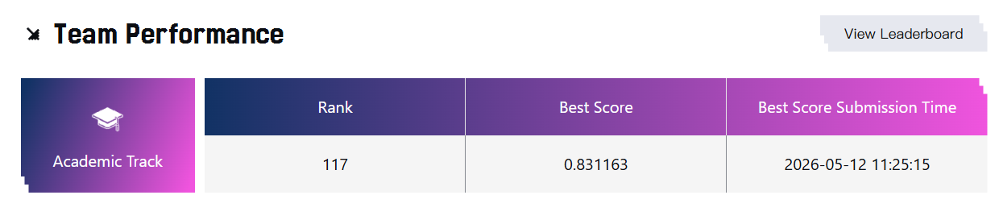

# PCVRHyFormer

> 面向 TAAC 2026 ：AUC 从 `0.8127` 提升至 **`0.8311`**（`+0.0184`）。

## 上分总览

| 版本 | 主要变更 | AUC | 单步提升 | 累计提升 |
| --- | --- | ---: | ---: | ---: |
| v1 | Baseline | 0.8127 | - | - |
| v3 | + Counterfactual Interest Residual (CIR) | 0.8142 | +0.0015 | +0.0015 |
| v4 | + Aligned Pair Tokenizer + Time Dense Features | 0.8150 | +0.0008 | +0.0023 |
| v5 | + Fourier Time Encoding + Feature Interaction | 0.8196 | +0.0046 | +0.0069 |
| v6 | + 2-layer Gated Deep Feature Interaction | 0.8289 | **+0.0093** | +0.0162 |
| v7 | + DIN Target Attention + CIR Gate Update | **0.8311** | +0.0022 | **+0.0184** |

## 上分点

### 1. CIR：从通用兴趣中提取目标兴趣

在主干之外增加一条目标感知分支，用候选商品查询用户历史，并减去不依赖商品的通用兴趣表示。这样模型不仅知道“用户喜欢什么”，也能刻画“用户为什么会对当前商品感兴趣”。

这一设计与序列编码器相对解耦：当任务存在明确的 `target-history` 匹配关系时，可以作为轻量残差模块接入现有 CTR/CVR 或推荐模型。

### 2. 对齐特征 Tokenizer 与时间密集特征

对具有一一对应关系的离散特征和连续特征进行联合 token 化，同时补充近期行为密度、时间间隔等统计信号，避免结构信息在简单拼接中被稀释。

这类改动适合迁移到字段结构清晰的数据集：无需大改主模型，只需在输入端保留特征配对关系，并增加稳定的 recency 表征。

### 3. Fourier 时间编码与显式特征交互

Fourier 编码为行为序列提供连续、多周期的时间表示；特征交互模块则让非序列特征不再只是线性聚合，而能学习组合模式。

二者分别覆盖“何时发生”和“哪些条件共同成立”。对于时间敏感、稀疏特征较多的推荐任务，这通常比单纯扩大 backbone 更直接。

### 4. 两层门控 Deep Feature Interaction

将单层交互扩展为两层门控残差交互，是本路线中最大的增益来源（`+0.0093`）。多层结构能够表达更高阶的特征组合，门控则控制复杂交互进入主干的强度。

该模块的扩展方向也很自然：可以调节交互层数、门控初始化或按特征组拆分 expert，在不改变序列建模框架的情况下探索容量与稳定性的平衡。

### 5. DIN Target Attention 与 CIR 联合

DIN 分支让候选商品直接关注原始历史序列位置，补充主干查询 token 的压缩损失；同时调整 CIR 门控，使目标相关兴趣更早参与训练。

这种并行目标注意力适用于 item、query、ad 等明确目标驱动的预测任务，也便于进一步加入时间偏置、行为类型偏置或多兴趣查询。

非常遗憾，没能更进一步；显然，这个模型还有更多的trcick和潜力有待发掘；